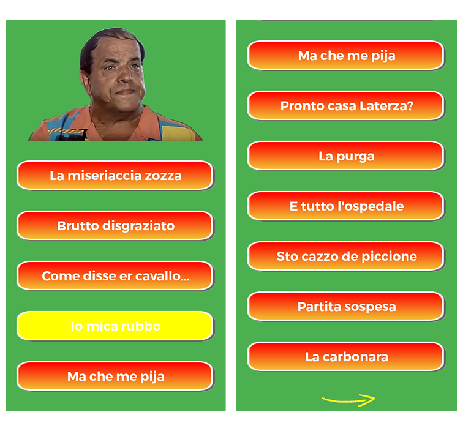

# Bombolo App

This was the first project I completed. It is an Android app made as a tribute to one of the greatest actors of Italian comedy movies, 
Franco Lechner, AKA [Bombolo](https://en.wikipedia.org/wiki/Bombolo).  

The app features playable samples of some of **Bombolo’s most famous lines** from the many movies he took part in.  

The app also shows a portrait of Bombolo, which you can click on. Every time the portrait is clicked the picture will change to show some of 
Bombolo’s most typical **facial expressions**, and also a random audio sample will be played.

 

  

 

There are around 20 audio samples and 10 different pictures in the app.

 

  

 

The app could not be published to the Play Store because of copyright concerns with the images used, but you can download it directly from this link:  

https://www.micpob.com/bombolo_app/bombolo_app.apk  

You can also download it by scanning the QR code below:

 

   

This is a simple project, but nonetheless I learned some useful lessons while building it, especially in regard to **audio and graphic assets** management.