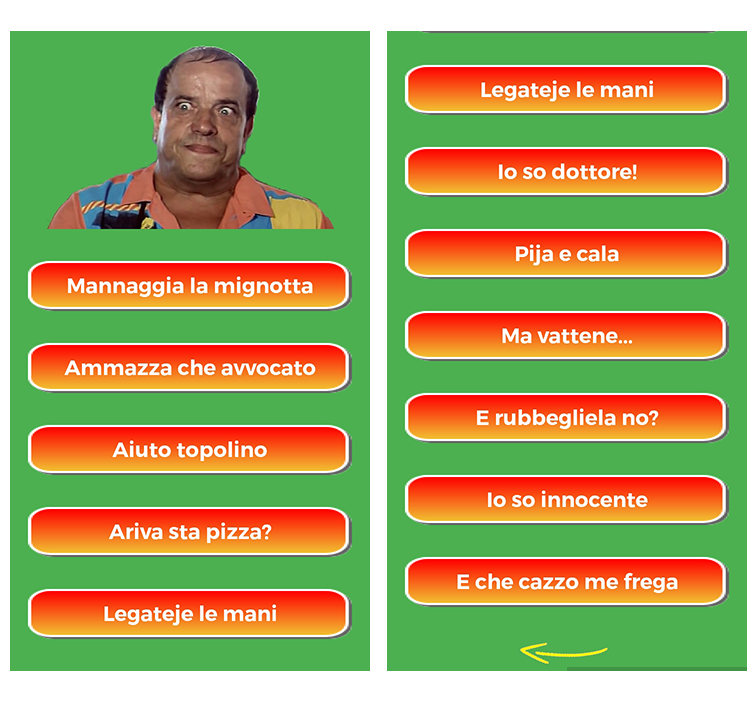

# Bombolo-App

This was the first project I completed. It is an Android app made as a tribute to one of the greatest actors of Italian comedy movies, 
Franco Lechner, AKA [Bombolo](https://en.wikipedia.org/wiki/Bombolo).  

The app features playable samples of some of **Bombolo’s most famous lines** from the many movies he took part in during the ’70 and ’80.  

The app also shows a portrait of Bombolo, which you can click on. Every time it is clicked, the picture will change to show some of 
**Bombolo’s most typical** facial expressions, and also a random audio line will be played.  

  

There are around 20 audio samples and 10 different pictures in the app.  

  

The app could not be published to the Play Store because of copyright concerns with the images used, but you can download it here in 
the repo, or directly from this link:  

https://www.micpob.com/bombolo_app/bombolo_app.apk  

You can also download it by scanning the QR code below:
 

 

This project is very simple, but nonetheless I think it is still interesting. I learned some useful lessons while building it, 
especially in regard to **audio and graphics assets** management.

All users that tried the app showed great appreciation for it and, even after years, I still make sure to install this app on every 
new phone I get, so from time to time I can listen to the wisdom of the great Bombolo and have a good laugh.
